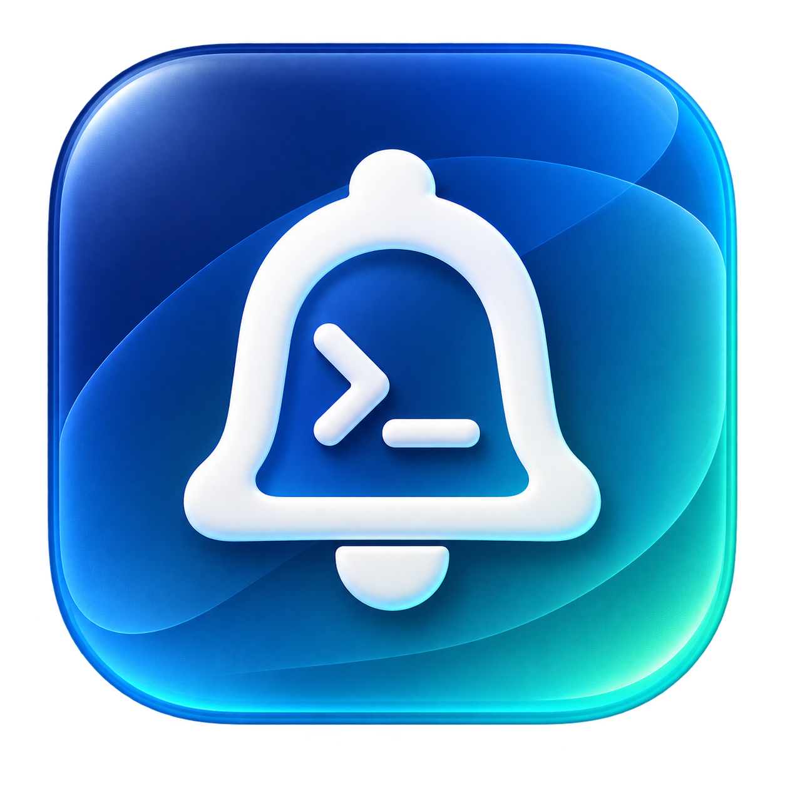

# BarkDesk

BarkDesk 是一个使用 Swift 和 SwiftUI 编写的 macOS 原生 Bark 控制中心，同时提供简洁的 `notify` CLI。它直接连接现有 Bark Server，不需要部署代理服务，也不会修改 Bark Server。

主要能力：

- 使用 macOS 原生界面配置 Bark Server、Device Key 和 Basic Auth。
- 从 GUI 发送通知，并且支持 Bark 的常用与高级参数。
- 使用 `notify "完成"`、stdin 或 `notify run command` 从终端发送通知。
- 使用同一份 SQLite 数据库查看 GUI 和 CLI 的本机发送历史，包括失败记录。
- 在 Integrations 页面复制 REST、兼容 Push URL、MCP URL 和调用示例。
- 提供菜单栏入口，可以快速打开 Compose 和历史记录。



> Bark Server 没有历史查询 API。BarkDesk 的历史仅包含这台 Mac 通过 BarkDesk GUI 或 `notify` CLI 发出的消息。

## 系统要求

- macOS 14 或更高版本
- Xcode 16 或更高版本，或者对应的 Swift toolchain
- 已经运行并且可以访问的 Bark Server
- 已经由 iPhone Bark App 注册的 Device Key

项目仅依赖 Apple 系统框架与系统 SQLite，不需要下载第三方 Swift package。

## 构建与安装

### 使用 Xcode 运行

请打开仓库根目录的 `BarkDesk.xcodeproj`，选择 `BarkDesk` scheme，然后按下 Run。这个 scheme 构建并运行真正的 macOS `BarkDesk.app`，同时会把独立的 `notify` 可执行文件复制到 App 的 Resources 中，因此引导页输入、键盘焦点和“安装 notify 命令”都使用完整的 macOS App 生命周期。

不要把 `Package.swift` 作为工程打开后直接运行 Swift Package 中的 `BarkDesk` executable；那个产物是裸命令行可执行文件，不是 macOS App bundle，不能用于 GUI 调试。

修改 `Xcode/project.yml` 后，可以重新生成工程：

```bash
make xcode-project
```

这一步需要本机安装 `xcodegen`；普通开发不需要重复生成，仓库已经包含生成好的 `BarkDesk.xcodeproj`。

### 使用命令行构建

开发构建和测试：

```bash
swift build
swift test
```

构建可直接打开的应用包：

```bash
make app
open build/BarkDesk.app
```

安装到当前用户目录：

```bash
make install
```

默认安装位置：

```text
~/.local/bin/notify
~/Applications/BarkDesk.app
```

请确保 `~/.local/bin` 已经加入 `PATH`。也可以在安装时修改路径：

```bash
BIN_INSTALL_DIR=/opt/homebrew/bin \
APP_INSTALL_DIR=/Applications \
make install
```

`build-app.sh` 会创建 ad-hoc 签名的本地应用。正式分发时，应当使用 Apple Developer ID 完成签名和 notarization。

## 首次配置

第一次打开 BarkDesk 时，应用会自动显示三步配置引导，不需要先寻找设置页面：

1. Bark Server Base URL，例如 `https://bark.example.com` 或带 URL Prefix 的 `https://example.com/bark`。
2. iPhone Bark App 已经注册的 Device Key。
3. 如果服务器启用了 Basic Auth，请填写用户名和密码。
4. 选择默认分组、提醒方式、提示音与归档行为。
5. 使用“检查连接”和“发送测试通知”验证完整链路。

应用启动时也会自动检查 `notify` 是否已经安装。如果没有检测到，主窗口内容区顶部会显示安装提示条。点击“安装”后，BarkDesk 会优先使用当前用户可写的 Homebrew 或 `/usr/local/bin` 目录；如果没有合适的公共命令目录，则安装到 `~/.local/bin/notify`。“设置”的“命令行工具”区域可以查看实际安装路径和状态，也可以重新执行检查。

Device Key、Basic Auth 用户名和密码保存在 macOS Keychain。普通默认设置保存在：

```text
~/Library/Application Support/BarkDesk/configuration.json
```

CLI 也可以执行基础配置：

```bash
notify config set \
  --server https://bark.example.com \
  --device DEVICE_KEY \
  --group terminal \
  --level active \
  --archive

notify config show
notify config test
```

为了避免密码进入 shell 历史，推荐通过 GUI 配置 Basic Auth。

## CLI 用法

最短用法：

```bash
notify "任务执行完成"
notify -t "Codex" "任务执行完成"
echo "Deploy finished" | notify -t "Server"
```

常用参数：

```bash
notify \
  -t "Deploy" \
  -s "Production" \
  -m "发布完成" \
  -g deploy \
  --level timeSensitive \
  --sound minuet \
  --url https://example.com/releases/42
```

Bark 高级类型：

```bash
# 重要警告，音量范围为 0 到 10
notify "服务不可用" --level critical --volume 8

# 重复铃声 30 秒
notify "请立即处理" --call

# 图片、图标、badge 与复制动作
notify "构建产物已经生成" \
  --image https://example.com/preview.png \
  --icon https://example.com/icon.png \
  --badge 3 \
  --copy "artifact-42"

# Bark 内归档，并且设置保留时间
notify "临时记录" --archive --ttl 3600

# Markdown 内容（需要较新的 Bark 与 Bark Server）
notify --markdown $'## Build\n\n**Success**'

# 点击通知时不执行动作
notify "仅供查看" --no-action
```

运行命令并在结束后提醒：

```bash
notify run pnpm build
notify run -g deploy --level timeSensitive -- ./deploy.sh --production
```

`notify run` 会继承命令的标准输入、标准输出和标准错误，等待命令结束，然后发送包含命令、耗时与退出码的通知。最终返回值始终是原命令的退出码；即使 Bark 发送失败，也不会将失败命令误报为成功。

查看历史：

```bash
notify history
notify history --search deploy --limit 50
```

完整参数说明：

```bash
notify --help
```

## GUI 页面

- 通知记录：按照今天、昨天、更早分组，支持搜索、复制、重新发送、打开链接和删除，并且为首次使用与无搜索结果提供明确引导。
- 发送通知：先选择普通通知、图片通知、链接通知、重要警告、快捷复制或 Markdown，再根据类型只显示必要字段；分组、提醒方式、提示音与归档位于可展开的发送选项中。
- 设置：实时校验 Server 地址、Device Key 与 Basic Auth，保存默认设置，并执行 ping、healthz、info、Device Key 检查和完整测试通知。
- 开发者接入：生成 Push URL、REST API、Bark Server MCP URL、curl、Shell 和 Claude Code 示例。

图片通知使用 Bark 官方的 `image` URL 参数。官方 Bark Server 没有文件上传接口，因此 GUI 会校验、预览并发送可以公开访问的图片链接，不会发送 iPhone 无法访问的 Mac 本地文件路径。

## 数据与架构

```text
BarkDesk GUI ─┐
              ├─ BarkCore ─ HTTP ─ Existing Bark Server ─ APNs ─ iPhone
notify CLI ───┘    │
                   ├─ macOS Keychain
                   └─ ~/Library/Application Support/BarkDesk/barkdesk.sqlite
```

`BarkCore` 统一实现 API、参数编码、配置、Keychain、SQLite 和发送历史。SwiftUI View 不直接调用 `URLSession`，CLI 也不重复实现网络或存储逻辑。

测试时可以通过 `BARKDESK_HOME` 使用隔离的数据目录：

```bash
BARKDESK_HOME=/tmp/barkdesk-test .build/debug/notify history
```

## Bark 支持范围

发送统一使用官方 API V2 的 `POST /push`。当前实现支持 `title`、`subtitle`、`body`、`markdown`、`level`、`volume`、`badge`、`call`、`autoCopy`、`copy`、`sound`、`icon`、`image`、`group`、`isArchive`、`ttl`、`url`、`action` 和 `id`。

连接检查使用 `/ping`、`/healthz`、`/info` 和 `/register/:device_key`。其中部分辅助接口可能由于 Bark Server 版本差异而不可用，因此 GUI 会分别显示每项结果；发送测试通知仍然是验证 Server、认证、Device Key、APNs 与 iPhone 全链路的最终方式。

## 当前不包含的能力

BarkDesk 不注册 macOS APNs，不接收 iPhone 通知，不提供新 Server、代理、账号、云同步、定时任务，也不会尝试调用不存在的 Bark Server 历史接口。
